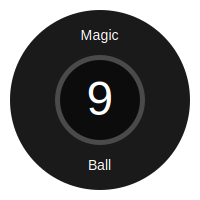

# Magic 9 Ball



## Description

Magic 9 Ball is a Python script that simulates a magic 8-ball with additional features. It's a fun project that combines fortune-telling with basic arithmetic capabilities. The Magic 9 Ball offers three main functionalities:

1. **Calculator**: Perform basic arithmetic operations.
2. **Prediction**: Ask a question and receive a mystical prediction.
3. **Quit**: Exit the program.

This project demonstrates the use of conditional logic, user input handling, and basic error checking in Python.

## Features

### Calculator
- Supports addition (+), subtraction (-), multiplication (*), division (/), modulus (%), and exponentiation (**)
- Handles division by zero errors

### Prediction
- Ask any question and receive one of ten possible predictions
- Prediction is determined based on the length of the question

## How to Use

1. Run the script:
   ```
   python magic9Ball.py
   ```

2. Choose one of the following options:
   - `c` for Calculator
   - `p` for Prediction
   - `q` to Quit

3. Follow the prompts for each option:
   - For Calculator: Enter the operation and two numbers
   - For Prediction: Enter your question
   - For Quit: The program will exit

## Example Usage

```
Welcome to the Magic 9 Ball...

By: Abhay Prasanna Rao

What would you like to do?

[c]alculator, [p]rediction, [q]uit: c

You Choose C!

Enter "+", "-", "*", "/", "%", or "**": +
Enter left hand side number: 5
Enter right hand side number: 3
+
The total is 8.0
```

## Author

Abhay Prasanna Rao

## Technologies Used

- Python 3
- Standard Python libraries (math)

## Future Improvements

- Add a graphical user interface (GUI)
- Expand the calculator functionality with more advanced operations
- Increase the number and variety of predictions
- Implement persistent storage for user history
